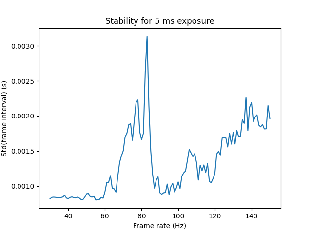

# piFLIR

Code for testing software triggered acquisition from FLIR USB3 cameras on Raspberry Pi. My goal for this project was to use multiple Raspberry Pi's with their clocks sync'd via PTP (IEEE 1588) to acquire frame synchronized video from multiple cameras. 

PTP easily syncs clocks better than 1 ms across Pis, but how does software triggering work, and what kind of frame rates can we achieve while still getting good sync?

### Hardware details.

I used the camera: [BFS-U3-23S3M-C](https://www.flir.com/products/blackfly-s-usb3/?model=BFS-U3-23S3M-C): it's a 2.3 MP (1920x1200) camera with a nominal 163 Hz frame rate. (I achieved that frame rate fine on a MacBook Pro.) For all these tests I verified the shutter window using an oscilloscope on the camera's digital outputs. I also used a Raspberry Pi 4, with 8 GB of RAM.

### USB3 Performance

The Pi takes data in at a pretty zippy clip. I could get frame rates up to about 120 Hz without a large number of dropped frames, although the sync suffered (see below). Above about 120 Hz data just doesn't get to the Pi fast enough to keep up.

### Getting data off the Pi

At 120 Hz for a full 1920x1200 pixel frame this represents a data rate of about 277 MB/s. However, it's tough to get data to disk in a reasonable amount of time. My SD card would only write at about 17 MB/s. I could get data off the Pi at 50 MB/s via gigabit ethernet. (This is about half the speed limit for GigE. I got a full gigabit using a benchmarking app; I suspect writing actual data from Python is CPU bound.) The fastest output was to a USB flash drive (Corsair GTX), and I got about 187 MB/s, and this was unaffected by enabling disk encryption.

Using a Raspberry Pi 4 with 8 GB of RAM, there's about 7 GB available to store data in memory. At 120 Hz this gives a buffer of about 25 seconds, which was reasonable for my purposes.

### Sync performance

Some parts of data readout from the camera are blocking, and won't allow the Python interpreter to switch to the thread that checks whether it's time to software trigger another frame yet. The result is that frames can be delayed if they are scheduled for triggering during the blocking readout. For low frame rates (< 60 Hz) each frame can be acquired and readout long before the next frame needs to be triggered, so it's not a problem. Around 70 Hz, the blocking part of frame readout occurs at the next trigger, so performance degrades. But as the framerate increases then frame 2 is triggered before the readout from frame 1 is ready to block. Since frame 1 is poised and read for readout as soon as frame 2 is triggered, there's enough time to complete the readout between frames and performance improves. Then as framerates climb higher, performance degrades again as there just isn't enough time between frames to get data off the camera.

This "doughnut hole" effect where frame rates around 70 Hz don't work well is totally surmountable; you just need to ensure that you don't start a readout unless you have enough time to finish it. Of course, for different frame sizes and exposure times your mileage about exactly where this effect occurs may vary. Here a plot shows the standard deviation of the inter-frame interval (measured at completion of read-out) for acquiring 3000 frames at a variety of frame rates, for a 5 ms exposure time.




### Other Key Points:
- Obviously long exposure times can prevent high frame rates
- Set TriggerOverlap to ReadOut to allow a new frame to be triggered while the old frame is still reading-out

### Installation notes:

I used Ubuntu 20.04 LTS

```
sudo apt install libusb-1.0-0 python3-pip ptpd net-tools
pip3 install numpy
pip3 install matplotlib
pip3 install RPi.GPIO
sudo apt install rpi.gpio-common
sudo apt-get install python3-tk
```

Install both:
```
spinnaker-2.2.0.48-Ubuntu20.04-arm64-pkg.tar.gz
spinnaker_python-2.2.0.48-Ubuntu20.04-cp38-cp38-linux_aarch64.tar.gz
tar xvfz *.gz
sudo ./install_spinnaker_arm.sh
```


